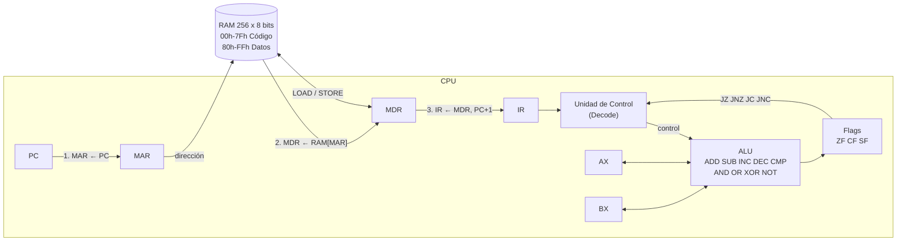
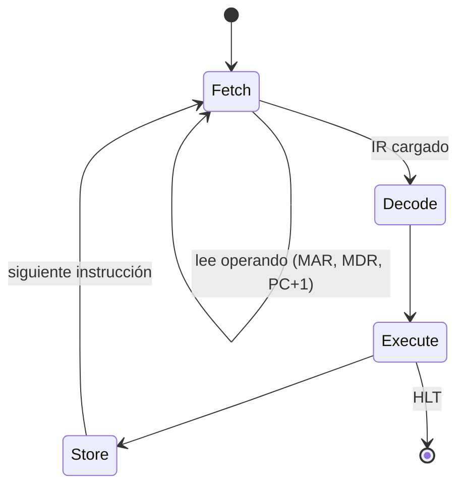

# Simulador de CPU de 8 bits y Memoria Principal

**Materia:** Arquitectura de Computadoras (SIS131) · Universidad Católica Boliviana "San Pablo", Santa Cruz

**Docente:** Ing. Paulo César Loayza Carrasco

**Estudiante:** Fernando Quiroz

**Evaluación:** Primer Parcial · Semestre 1/2026

**Plataforma:** Google Sheets + Google Apps Script (JavaScript)

Simulador interactivo de una CPU de arquitectura von Neumann (estilo x86 simplificado, 8 bits) con una RAM de 256 bytes. Descompone cada instrucción en el ciclo **Fetch → Decode → Execute → Store**, con ejecución paso a paso o continua, resaltado de componentes activos y un log de micro-operaciones.

## 1. Arquitectura



### Ciclo de instrucción



Cada pulsación de **STEP** ejecuta una micro-operación:

| Fase | Micro-operación |
|---|---|
| Fetch | `MAR ← PC` → `MDR ← RAM[MAR]` → `IR ← MDR; PC ← PC+1` (se repite para leer el operando si la instrucción lo tiene) |
| Decode | La unidad de control interpreta el opcode y el modo de direccionamiento |
| Execute | La ALU opera, se actualizan las banderas o se calcula el salto. En `LOAD`/`STORE` se preparan `MAR` y `MDR` |
| Store | Se guarda el resultado en `AX`/`BX` o en memoria (`RAM[MAR] ← MDR`) |

### Mapa de memoria

| Rango | Segmento | Color |
|---|---|---|
| `00h`–`7Fh` | Código (instrucciones) | Azul |
| `80h`–`FFh` | Datos | Verde |

Cada celda se muestra en hexadecimal; el **inspector** (celda `B19`) muestra hexadecimal, binario, decimal y valor con signo (complemento a 2).

### Registros y banderas

| Registro | Función |
|---|---|
| PC | Dirección de la siguiente instrucción |
| IR | Instrucción en curso |
| MAR | Dirección que se lee o escribe en RAM |
| MDR | Dato transferido desde/hacia RAM |
| AX, BX | Registros de propósito general de 8 bits |
| ZF | 1 si el resultado fue cero |
| CF | 1 si hubo acarreo (suma) o préstamo (resta) sin signo |
| SF | Bit más significativo del resultado |

Detalles: `INC`/`DEC` no modifican `CF` (como en x86). Las operaciones lógicas ponen `CF=0`. `MOV`, `LOAD`, `STORE` y los saltos no modifican banderas.

## 2. Conjunto de instrucciones (ISA)

`imm` = valor inmediato de 1 byte · `dir` = dirección de 1 byte · `[dir]` = contenido de esa dirección.

| Opcode | Instrucción | Bytes | Descripción |
|---|---|---|---|
| `01` | `MOV AX, imm` | 2 | AX ← imm |
| `02` | `MOV BX, imm` | 2 | BX ← imm |
| `03` | `MOV AX, BX` | 1 | AX ← BX |
| `04` | `MOV BX, AX` | 1 | BX ← AX |
| `05` | `LOAD AX, [dir]` | 2 | AX ← RAM[dir] |
| `06` | `LOAD BX, [dir]` | 2 | BX ← RAM[dir] |
| `07` | `STORE [dir], AX` | 2 | RAM[dir] ← AX |
| `08` | `STORE [dir], BX` | 2 | RAM[dir] ← BX |
| `10` | `ADD AX, imm` | 2 | AX ← AX + imm (ZF, CF, SF) |
| `11` | `ADD AX, BX` | 1 | AX ← AX + BX |
| `12` | `ADD BX, imm` | 2 | BX ← BX + imm |
| `13` | `ADD BX, AX` | 1 | BX ← BX + AX |
| `20` | `SUB AX, imm` | 2 | AX ← AX − imm (ZF, CF, SF) |
| `21` | `SUB AX, BX` | 1 | AX ← AX − BX |
| `22` | `SUB BX, imm` | 2 | BX ← BX − imm |
| `23` | `SUB BX, AX` | 1 | BX ← BX − AX |
| `30` | `INC AX` | 1 | AX ← AX + 1 (ZF, SF) |
| `31` | `INC BX` | 1 | BX ← BX + 1 |
| `32` | `DEC AX` | 1 | AX ← AX − 1 (ZF, SF) |
| `33` | `DEC BX` | 1 | BX ← BX − 1 |
| `40` | `CMP AX, imm` | 2 | AX − imm, solo banderas |
| `41` | `CMP AX, BX` | 1 | AX − BX, solo banderas |
| `42` | `CMP BX, imm` | 2 | BX − imm, solo banderas |
| `43` | `CMP BX, AX` | 1 | BX − AX, solo banderas |
| `50` | `AND AX, BX` | 1 | AX ← AX & BX |
| `51` | `OR AX, BX` | 1 | AX ← AX \| BX |
| `52` | `XOR AX, BX` | 1 | AX ← AX ^ BX |
| `53` | `NOT AX` | 1 | AX ← ~AX |
| `60` | `JMP dir` | 2 | PC ← dir |
| `61` | `JZ dir` | 2 | Salta si ZF = 1 |
| `62` | `JNZ dir` | 2 | Salta si ZF = 0 |
| `63` | `JC dir` | 2 | Salta si CF = 1 (extra) |
| `64` | `JNC dir` | 2 | Salta si CF = 0 (extra) |
| `FF` | `HLT` | 1 | Detiene el reloj |

Un opcode desconocido detiene la CPU con un mensaje en el log.

## 3. Manual de usuario

### Instalación
1. Crea una hoja de cálculo en Google Sheets.
2. Abre **Extensiones → Apps Script** y crea cuatro archivos con el contenido de `src/`: `Config.gs`, `Memoria.gs`, `CPU.gs` y `UI.gs`.
3. Guarda (Ctrl+S). En el desplegable de funciones elige `SETUP` y pulsa **Ejecutar**. Acepta los permisos la primera vez.
4. Vuelve a la hoja y recárgala (F5). Aparece la pestaña **Simulador** y el menú **CPU Simulador**.

### Controles (menú CPU Simulador)
| Opción | Efecto |
|---|---|
| RUN | Ejecuta automáticamente con el retardo de la celda `B25` (ms) |
| PAUSE | Detiene el RUN; se puede continuar con STEP o RUN |
| STEP (micro-operación) | Avanza un paso del ciclo (por ejemplo, solo `MAR ← PC`) |
| STEP instrucción | Ejecuta una instrucción completa |
| RESET | PC, registros y banderas a cero; no borra la RAM |
| LOAD PROGRAM | Carga la multiplicación o Fibonacci |
| Reconstruir hoja (SETUP) | Redibuja la interfaz |

Los mismos scripts se pueden asignar a botones dibujados (**Insertar → Dibujo → Asignar script**).

### Lectura de la interfaz
- **Panel izquierdo:** registros, banderas, fase actual y contadores.
- **Cuadrícula central:** RAM. Ámbar = PC, azul = MAR, color de fase = celda accedida, verde intenso = escritura.
- **Log (columna W):** micro-operaciones cronológicas.
- **Listado (columna Y):** programa desensamblado.

Se puede editar cualquier celda de la RAM (dos dígitos hex) y el listado se actualiza al instante.

## 4. Programa demostrativo: multiplicación por sumas sucesivas

Calcula `[80h] × [81h]` y deja el resultado en `[82h]`. Datos iniciales: `[80h]=06`, `[81h]=05`, `[82h]=00` (6 × 5).

```
00: 05 81     LOAD AX, [81]     ; AX ← contador
02: 40 00     CMP  AX, 0
04: 61 18     JZ   18h          ; si el contador es 0, fin
06: 01 00     MOV  AX, 0
08: 07 82     STORE [82], AX    ; resultado ← 0
0A: 05 82     LOAD AX, [82]     ; ← inicio del bucle
0C: 06 80     LOAD BX, [80]
0E: 11        ADD  AX, BX
0F: 07 82     STORE [82], AX
11: 05 81     LOAD AX, [81]
13: 32        DEC  AX
14: 07 81     STORE [81], AX
16: 62 0A     JNZ  0Ah          ; repite mientras el contador ≠ 0
18: FF        HLT
```

### Traza de registros

Estado inicial: AX = 00, BX = 00, ZF = CF = SF = 0.

**Preámbulo y primera iteración**

| Dir | Instrucción | AX | BX | ZF | CF | SF | Memoria modificada | Siguiente PC |
|---|---|---|---|---|---|---|---|---|
| 00 | `LOAD AX,[81]` | 05 | 00 | 0 | 0 | 0 | — | 02 |
| 02 | `CMP AX,0` | 05 | 00 | 0 | 0 | 0 | — | 04 |
| 04 | `JZ 18h` | 05 | 00 | 0 | 0 | 0 | no salta | 06 |
| 06 | `MOV AX,0` | 00 | 00 | 0 | 0 | 0 | — | 08 |
| 08 | `STORE [82],AX` | 00 | 00 | 0 | 0 | 0 | [82]=00 | 0A |
| 0A | `LOAD AX,[82]` | 00 | 00 | 0 | 0 | 0 | — | 0C |
| 0C | `LOAD BX,[80]` | 00 | 06 | 0 | 0 | 0 | — | 0E |
| 0E | `ADD AX,BX` | 06 | 06 | 0 | 0 | 0 | — | 0F |
| 0F | `STORE [82],AX` | 06 | 06 | 0 | 0 | 0 | [82]=06 | 11 |
| 11 | `LOAD AX,[81]` | 05 | 06 | 0 | 0 | 0 | — | 13 |
| 13 | `DEC AX` | 04 | 06 | 0 | 0 | 0 | — | 14 |
| 14 | `STORE [81],AX` | 04 | 06 | 0 | 0 | 0 | [81]=04 | 16 |
| 16 | `JNZ 0Ah` | 04 | 06 | 0 | 0 | 0 | salta | 0A |

**Resumen de las cinco iteraciones**

| Iteración | AX tras `ADD` | [82h] | Contador tras `DEC` | ZF | `JNZ` |
|---|---|---|---|---|---|
| 1 | 06 | 06 | 04 | 0 | salta |
| 2 | 0C | 0C | 03 | 0 | salta |
| 3 | 12 | 12 | 02 | 0 | salta |
| 4 | 18 | 18 | 01 | 0 | salta |
| 5 | 1E | 1E | 00 | 1 | no salta → `HLT` |

**Estado final:** AX = 00, BX = 06, ZF = 1, CF = 0, SF = 0, PC = 19h, `[82h] = 1Eh = 30`. La ejecución completa registra 45 instrucciones y 380 micro-operaciones, más el `HLT` final.

### Segundo programa: Fibonacci hasta desbordar 8 bits

Usa `JC` para detectar el acarreo. El último término válido, `E9h` (233), queda en `[80h]`. En la suma que desborda (`90h + E9h`), el resultado queda en `79h` con `CF = 1`.

## 5. Estructura del repositorio

```
src/
  Config.gs    Constantes, tabla ISA y programas demostrativos
  Memoria.gs   RAM, Read/Write, desensamblador
  CPU.gs       Registros, ALU, ciclo de instrucción y controles
  UI.gs        Construcción de la hoja, resaltado y menú
```

El código está separado por responsabilidades para ampliarlo en el Segundo Parcial (bus, E/S e interrupciones).

## 6. Gestión del proyecto

Tablero Kanban en GitHub Projects, con issues y criterios de aceptación por componente. Los commits siguen convenciones semánticas y están enlazados a los issues.

## 7. Uso de herramientas de IA

Este proyecto se desarrolló con asistencia de **Claude (Anthropic)**, que generó la base del código en Google Apps Script a partir del enunciado del parcial. El estudiante:

- montó el proyecto en Google Sheets y Apps Script;
- ejecutó y probó el simulador (multiplicación, Fibonacci, rama `JZ`, PAUSE, RESET y edición de memoria);
- organizó el repositorio, los issues y el tablero Kanban.
